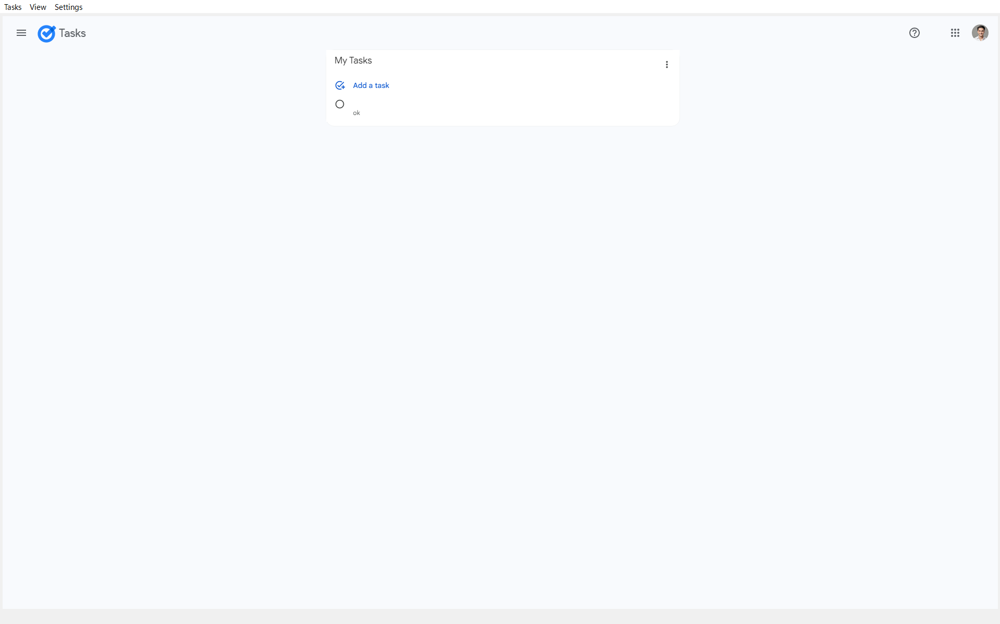
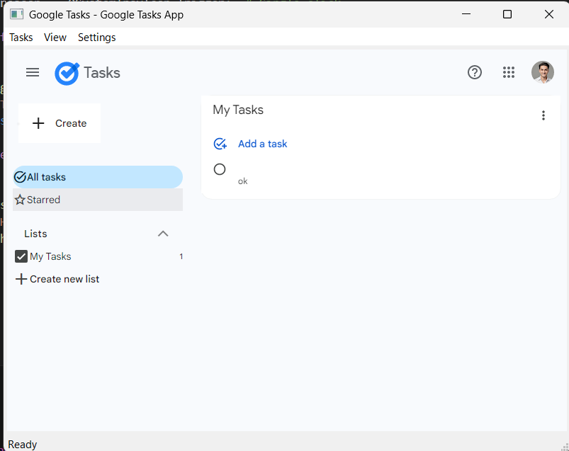
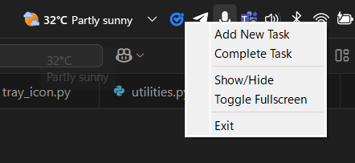

# Google Tasks Desktop App



A feature-rich desktop application for Google Tasks with system tray integration, built with PyQt5.

## Features ✨

- 🖥️ **Desktop Interface** for Google Tasks
- 📌 **System Tray Integration** (minimize to tray)
- 🔍 **Mini Task View** for quick access
- 🎨 **Custom Themes** (light/dark/sepia)
- 🔔 **Task Notifications**
- 📤 **Task Export** (JSON/CSV/TXT)
- ⌨️ **Keyboard Shortcuts**





## Installation 🛠️

### Requirements
- Python 3.6+
- PyQt5
- PyQtWebEngine

### Steps
1. Install dependencies:
```bash
pip install PyQt5 PyQtWebEngine